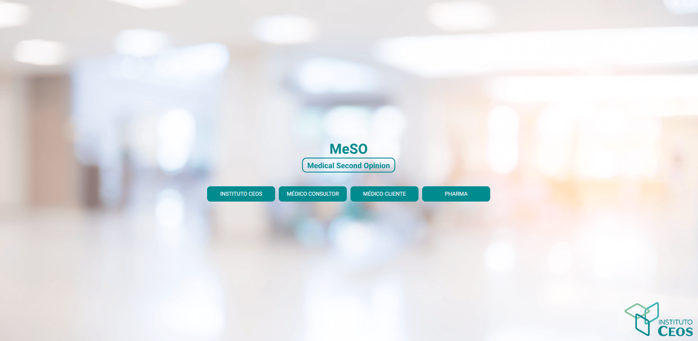

<!-- Title -->
<h1 align="center"> Ceos  </h1>

<!-- Subtitle -->
<h2 align="center"> Medical Second Opinion </h2>

### Projeto

Espaço para introdução e resumo da plataforma.

## 🖼️ Imagens do Projeto

  

### Features desenvolvidas

- [x] **Login**: Login.

- [x] **Início**: Home.

- [ ] **Casos**: Casos Clínicos Designados.

<!-- Instituto Ceos -->

- [x] **Cadastro**: Cadastro Indústria.

- [ ] **Registro**: Registro de Contrato e Geração de Casos Clínicos.

- [ ] **Consulta**: Consulta Casos Clínicos.

- [ ] **Consulta**: Geração de Consulta para Médico Consultor.

- [ ] **Cancelamento**: Cancelamento de Acesso ao Sistema.

<!-- Médico Consultor -->

- [x] **Cadastro**: Cadastro Médico Consultor.

- [ ] **Administração**: Administração de Casos Clínicos Designados.

<!-- Patrocinador -->

- [x] **Cadastro**: Cadastro Representante.

- [x] **Atribuição**: Atribuição de Casos Clínicos.

- [x] **Casos**: Casos Clínicos Designados.

<!-- Médico Cliente -->

- [x] **Cadastro**: Cadastro. 

### Testes

- [ ] **Jest**: Testes unitários focados nos componentes da aplicação.
  
- [ ] **Cypress**: Testes automatizados das features como um todo.

### Conceitos abordados

- Controle de rotas com [Vue Router](https://router.vuejs.org/).

- Controle de estudos e mutações das functions utilizando [Vue X](https://vuex.vuejs.org/).

- Uso de flexbox para alinhar e ajustar elementos na página.

- Testes unitários com Jest

- Testes de integração com Cypress

## :rocket: Tecnologias

-  [Vue](https://vuejs.org/guide/introduction.html)
-  [Vue Router](https://router.vuejs.org/)
-  [Vue X](https://vuex.vuejs.org/)
-  [Axios](https://github.com/axios/axios)
